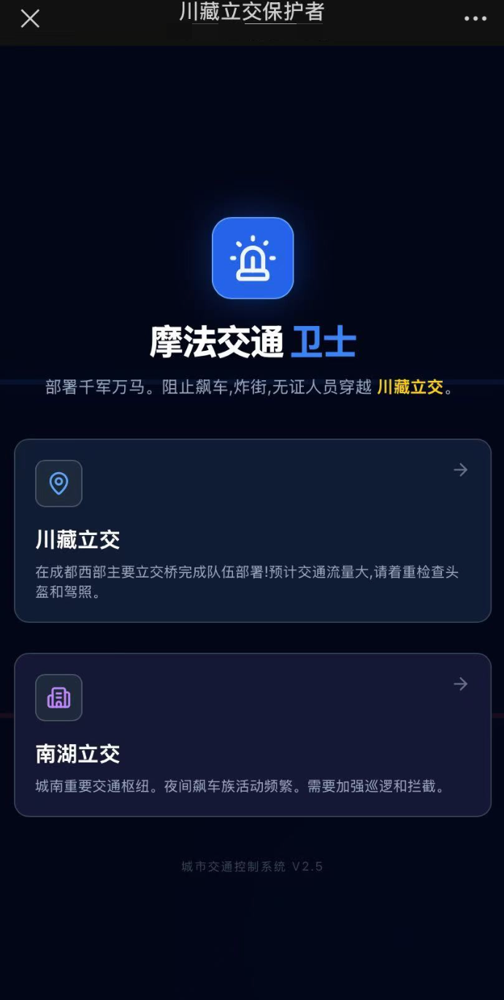
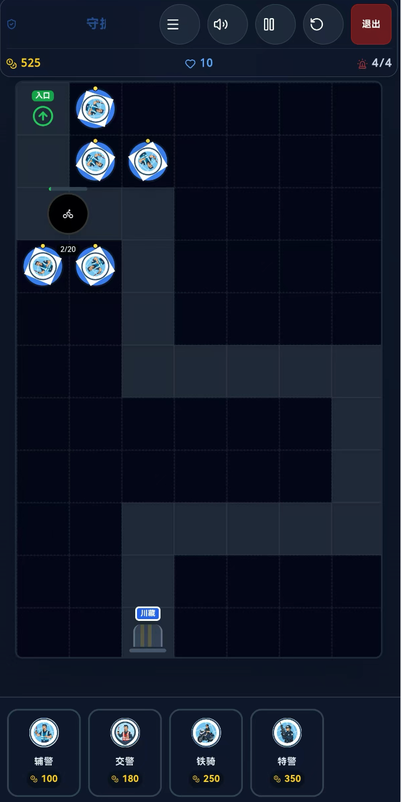
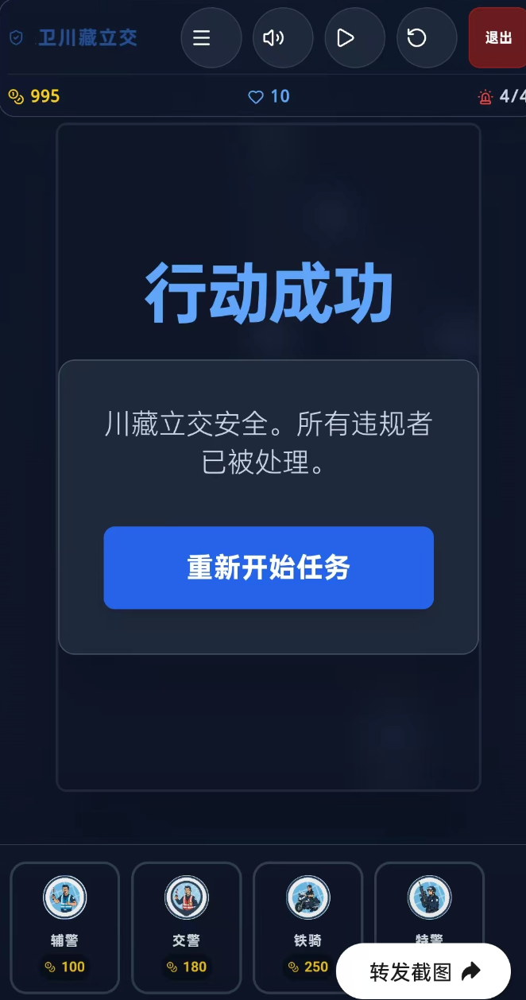

| 入口 | 游戏界面 | 游戏界面2 |
|:-:|:-:|:-:|
||||

## Run Locally

**Prerequisites:**  Node.js

1. Install dependencies:
   `npm install`
2. Set the `GEMINI_API_KEY` in [.env.local](.env.local) to your Gemini API key
3. Run the app:
   `npm run dev`
